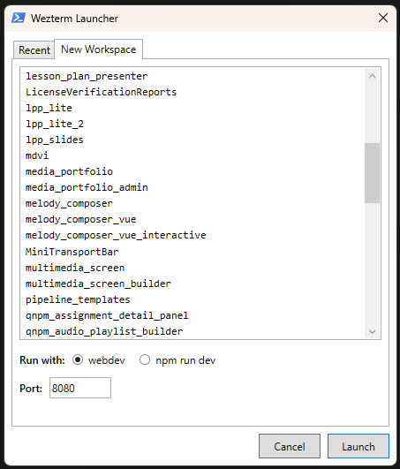

# wezterm-launcher

A lightweight WPF GUI launcher for [WezTerm](https://wezfurlong.org/wezterm/) workspaces on Windows, built with PowerShell.



## Features

- **First-run setup** — asks where your projects live and saves it to `~/.config/wezterm/projects_root.txt` so WezTerm workspace launches use the same root.
- **Recent tab** — lists workspaces from launcher history and the Windows Run MRU.
- **New Workspace tab** — browses folders under your projects root and launches a WezTerm workspace with a chosen dev server command.
- **Command preview** — shows the exact `wezterm start` command before you launch it.
- **Run-mode options**:
  - `webdev` — runs `webdev serve web:<port>` (default port `8080`)
  - `npm run dev` — runs `npm run dev -- --port=<port>` (default port `5173`), with an optional `dev-dummy` toggle

## Requirements

- Windows with PowerShell 5.1+
- [WezTerm](https://wezfurlong.org/wezterm/) installed and on `PATH`
- .NET / WPF available (included with Windows)
- `~/.wezterm.lua` present (usually symlinked from this dotfiles repo)

## Usage

Double-click **`launch.bat`**, or create a shortcut to it. The script runs PowerShell hidden in the background and opens the GUI immediately.

```
launch.bat
```

You can also pin `launch.bat` to your taskbar, or use **Win+Shift+R** after PowerToys Keyboard Manager is configured by `pc/install/setup.ps1`.

### First run

1. Pick the folder that contains your project directories (e.g. `D:\git` or `Documents`).
2. That path is saved to `%APPDATA%\wezterm-launcher\config.json`.
3. `~/.config/wezterm/projects_root.txt` is written so `.wezterm.lua` picks up the same root.

To change it later, delete `%APPDATA%\wezterm-launcher\config.json` and run the launcher again.

### Recent tab

Reads launcher history plus the Windows **Run** dialog MRU (`HKCU:\Software\Microsoft\Windows\CurrentVersion\Explorer\RunMRU`) for entries matching:

```
wezterm start <workspace-name> "<command>"
```

Select a workspace and click **Launch** (or press Enter) to reopen it.

### New Workspace tab

1. Select a folder from the list (populated from your projects root).
2. Choose a run mode (`webdev` or `npm run dev`).
3. Optionally toggle **dummy** mode (only visible for `npm run dev`).
4. Adjust the port if needed.
5. Click **Launch**.

## Configuration

| Value | Location |
|-------|----------|
| Projects root | `%APPDATA%\wezterm-launcher\config.json` (`projectsRoot`) |
| WezTerm projects root | `~/.config/wezterm/projects_root.txt` |
| Script path | `launch.bat` → `%~dp0launcher.ps1` |

This lives in the dotfiles repo at `pc/wezterm-launcher/`.

## Files

| File | Purpose |
|------|---------|
| `launcher.ps1` | Main script — setup prompt, WPF GUI, launch logic |
| `launch.bat` | Thin wrapper that runs `launcher.ps1` hidden |
